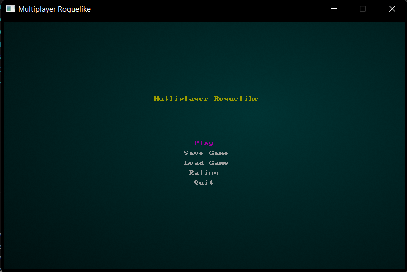

### About
-------------------------------------------

🧝**Roguelike Multiplayer Game**🧙‍♂️ written on Rust and C++

*In the game you can:*
1. fight monsters
2. team up and play together with your friends
3. pass an infinite number of levels
4. use a huge number of weapons and spells: swords, health potions, fireballs and more
5. save the game and load saving
6. see players rating

The game starts with **entering name**:


**Single Game:**


**Multiplayer:**

\* *Blue entity is a player from another computer*

**Main menu:**


**Rating:**


### Installing
-------------------------------------------

#### For players
- Make sure you have the rust compiler installed
```rust
cargo --version
```
  if you do not have a compiler, [download it](https://rustup.rs/)

  \* If it does not work after this step, try this:
```bash
export PATH="~/.cargo/bin"
export PATH="~/.cargo/env"
```

- Enter:
```bash
cargo run
```
from the directory where the `Cargo.toml` file is

-------------------------------------------

#### For developers
- Make sure you have the rust compiler installed
```rust
rustc --version
```
  if you do not have a compiler, [download it](https://rustup.rs/)
  
- [Download CMake](https://cmake.org/install/) if you don't have it
  
To check enter:
```bash
cmake --version
```
  
- From the `src/` directory:
```bash
cd server/server
mkdir build
cd build
cmake ..
make
./server
```

- Change url address in `main.rs` on "ws://127.0.0.1:6881":
```rust
// initialize game state
    let mut gs = State{
        ecs : World::new(),
        game_client : ClientHandler::new(Url::parse("ws://127.0.0.1:6881").expect("Address error")),
        player_name : String::new(),
        enemies : Vec::<String>::new(),
    };
```

- Enter:
```bash
cargo run
```
from the directory where the `Cargo.toml` file is

**Now experiment with client and server!**🧑‍🔬

### Licence
-------------------------------------------

Licensed under:
- MIT license ([LICENSE-MIT](https://github.com/seanmonstar/httparse/blob/master/LICENSE-MIT) or [https://opensource.org/licenses/MIT](https://opensource.org/licenses/MIT))
